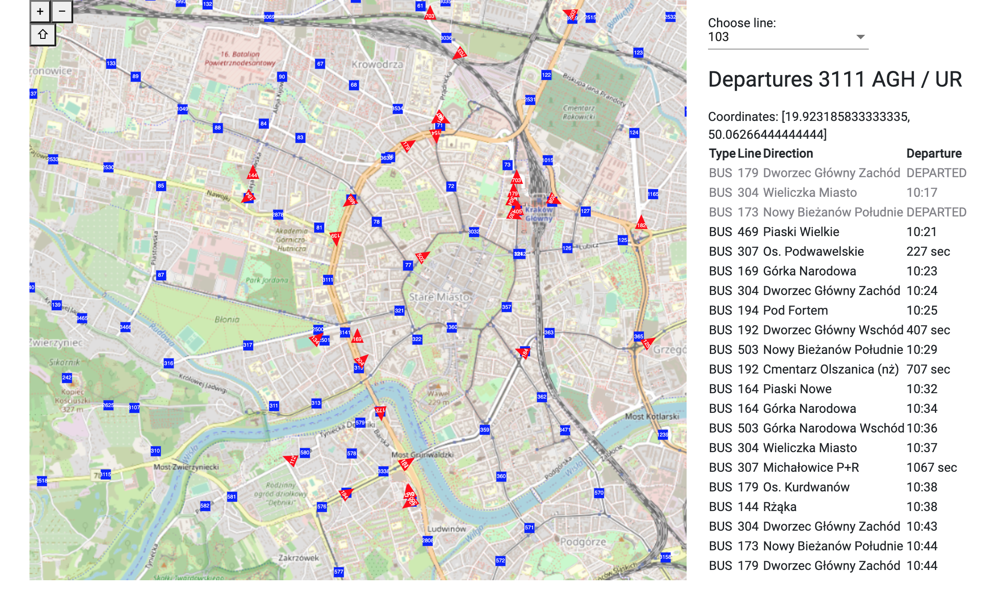
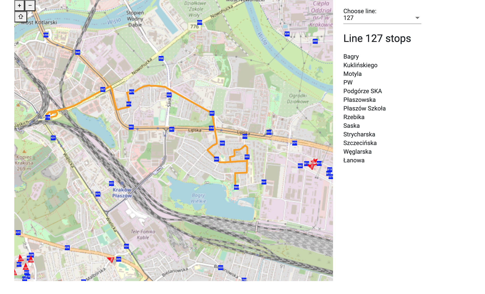
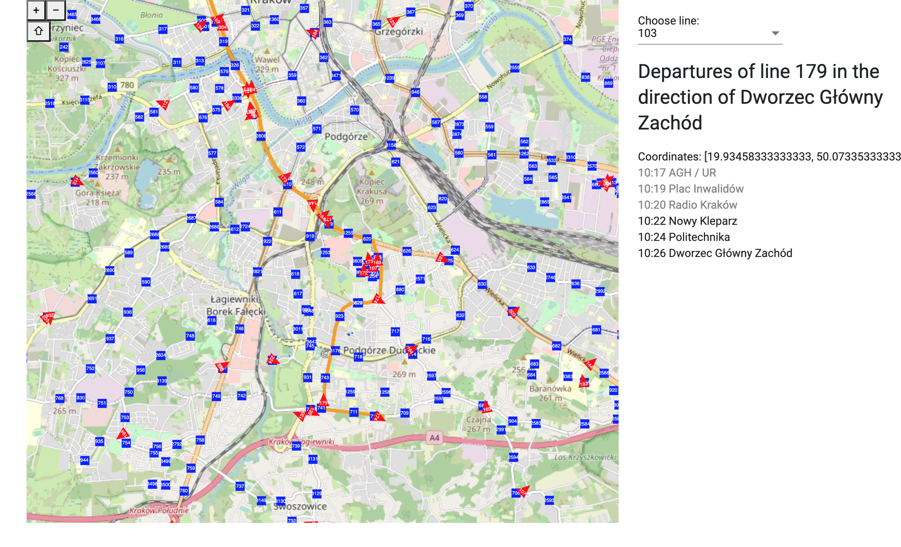

# Bus Tracker Krakow

A web application that makes it easier for passengers to track buses in Krakow generated with [Angular CLI](https://github.com/angular/angular-cli) version 9.1.6. It shows vehicles, routes, lines and stops. 

Clicking on a stop shows which buses are coming next.

You can choose a desired line to see the route and its stops.

A clicked vehicle shows its status and route.

## Instructions

### Docker

Create a new docker image `docker build -t test:dev .`. Next run the image `docker run --rm -p 4200:80 test:dev`

### Development server

Run `ng serve` for a dev server. Navigate to `http://localhost:4200/`. The app will automatically reload if you change any of the source files.